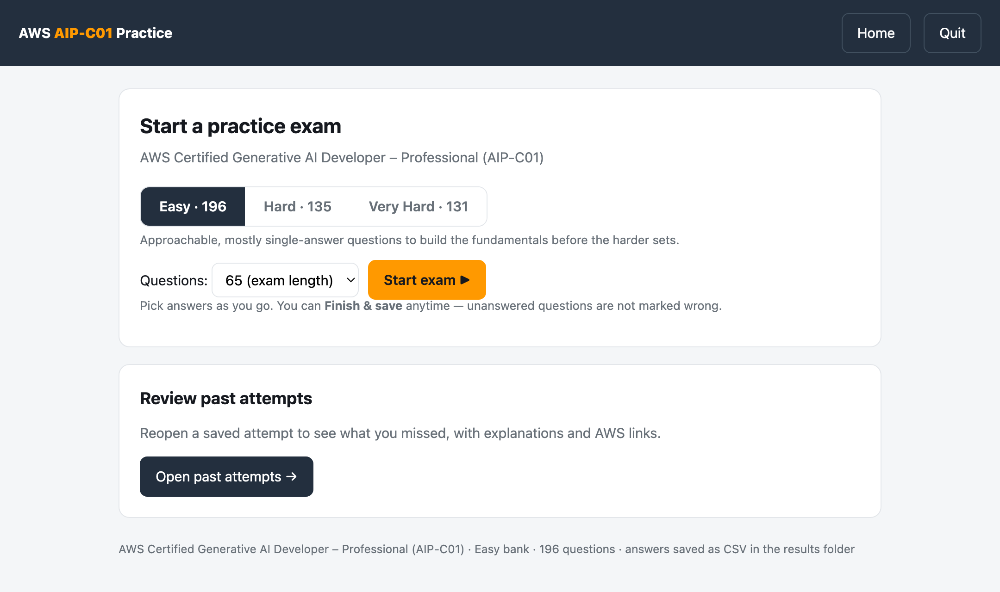

# AWS AIP-C01 Practice Exam

A tiny, **local** practice-exam app for the **AWS Certified Generative AI Developer – Professional (AIP-C01)** exam. Pick a difficulty, take an exam at your own pace, and every attempt is saved as a CSV you can review later — with explanations and links to the AWS docs.

No installs, no accounts, nothing sent to the cloud. Just Python 3 (which already ships with macOS and Linux).



## Run it

**Any OS — from a terminal:**

```bash
python3 app.py
```

It opens automatically at <http://localhost:8000>. Stop it with the **Quit** button (top-right) or `Ctrl+C`.

**Or just double-click:**

| OS | File | Note |
|----|------|------|
| macOS | `Start AWS Quiz.command` | First run only: right-click → **Open** → **Open** to get past Gatekeeper. |
| Windows | `Start AWS Quiz.bat` | Needs Python from [python.org](https://www.python.org/downloads/) — tick **“Add python.exe to PATH”** when installing. |
| Linux | `python3 app.py` | The terminal command above. |

## What you get

- **Three difficulty tiers** — **Easy** (196 q) builds fundamentals; **Hard** (135 q) mirrors the real exam (long scenarios, “select TWO”, lowest-overhead framing); **Very Hard** (131 q) has *no* obvious answer — every distractor is plausible and the explanation says why each tempting option loses.
- **Take an exam** — choose **20 / 40 / 65 / all** questions and answer at your own pace.
- **Flag for review** — press **F** on anything you’re unsure about; flags are saved with the attempt.
- **Finish anytime** — unanswered questions are **not** counted wrong; your score is `correct ÷ answered`.
- **Auto-save** — answers are saved after every selection, so quitting mid-exam loses nothing.
- **Review past attempts** — reopen any attempt to see what you missed, with explanations and “Read more on AWS” links, filterable by Incorrect / Skipped / Flagged.

Each attempt is one CSV in **`results/`** (openable in Excel). Results stay on your machine and are git-ignored.

## Add or edit questions

The three banks live in **`questions/`**. Each is a self-contained JSON file, and the `_comment` at the top documents the schema. To add a question, append an object to its `questions` array:

```json
{
  "id": "1.4-13",
  "task": "1.4",
  "type": "single",
  "question": "…",
  "options": [
    { "text": "…", "correct": true,  "explanation": "why it’s right" },
    { "text": "…", "correct": false, "explanation": "why it’s wrong" }
  ]
}
```

- `type` is `"single"` (exactly one correct) or `"multi"` (two or more correct, graded all-or-nothing).
- `task` must be a key in that file’s `tasks` map (each task supplies the AWS doc links shown in review).
- Changes appear on browser **reload** — no restart needed.

> **Tip:** paste a whole bank into an LLM and ask it to add questions for a task in the same style.

## Project layout

```
app.py          The local web server — Python standard library only, no dependencies.
index.html      The entire UI in one file.
questions/      The three question banks (edit these).
results/        Your saved attempts (CSV; git-ignored).
study-aids/     Extra flashcards, a practice-question sheet, and the LLM prompts used to make them.
```

## License

MIT — see [`LICENSE`](LICENSE). Free to use, share, and adapt for your own studying.
